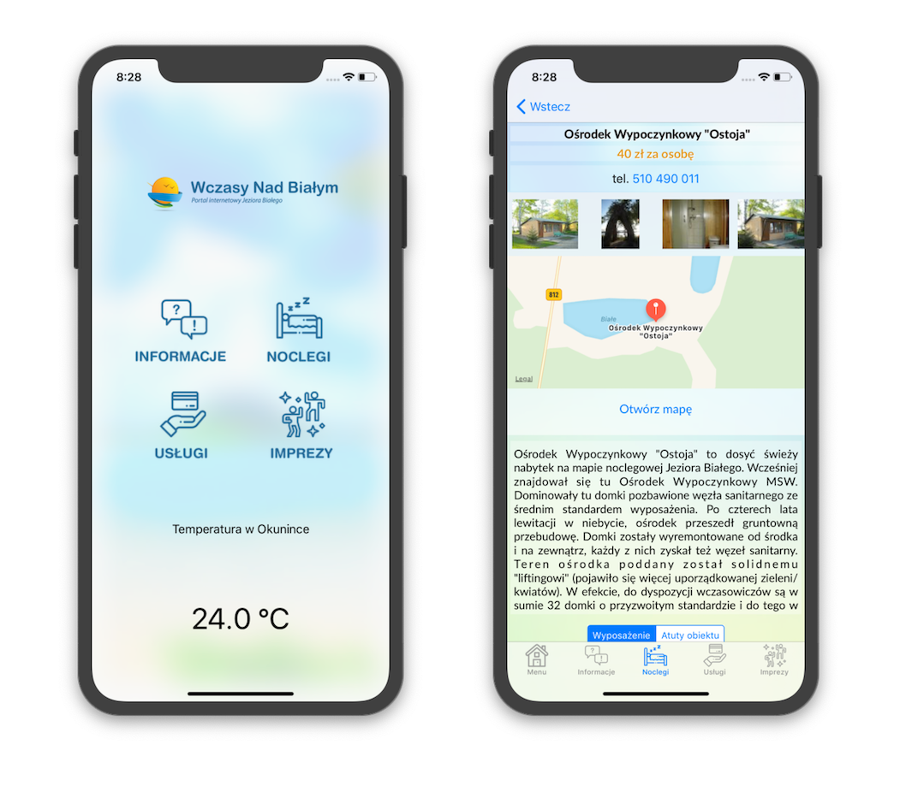
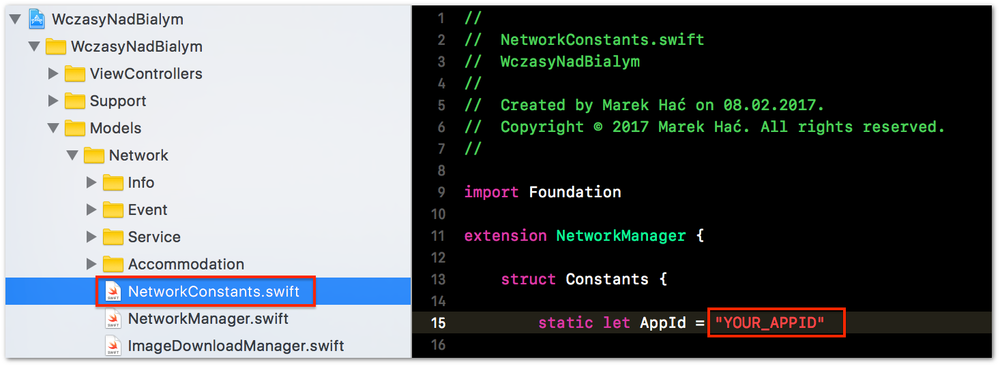

# WczasyNadBialym (iOS App)

This is a development version of the iOS Mobile App for travelers. It will be particulary useful for tourists who wants to visit one of the greatest Lake in Poland (White Lake in Okuninka). 

This is universal App and it should look "pretty" both on iPad and iPhone.

Technologies used: **Swift 4, Auto Layout, Size Classes, Codable Protocol (JSON parsing)**

Checkout WczasyNadBialym website available at [wczasynadbialym.pl](http://wczasynadbialym.pl)

*For more details scroll down below these lovely screenshots :)*



**Requirements**

- Xcode 9 or newer
- iPhone or iPad device with iOS 9  
- Special AppID token (can be generated [here](http://wczasynadbialym.pl/index/appid-request) for free)

**Source code**

- Clone app repository 

	```$ git clone git@github.com:marekhac/WczasyNadBialym-iOS.git```
	
**Create AppID token**

Request for free `AppID` token to be able to get any responces from WczasyNadBialymAPI. It's free. Just fill the form at the following [page](http://wczasynadbialym.pl/index/appid-request). Your `AppID` will be generated automatically.

**Before first run**

- Using Terminal go to the project folder, in which you cloned the app repo. 
- Install cocoapod packages

	```$ pod install```
	
- Open `WczasyNadBialym.xcworkspace` file in Xcode 
- Find the `NetworkConstants.swift` file 



- Assign your token to `AppId` static variable

	example: ``` static let AppId = "123456"```


